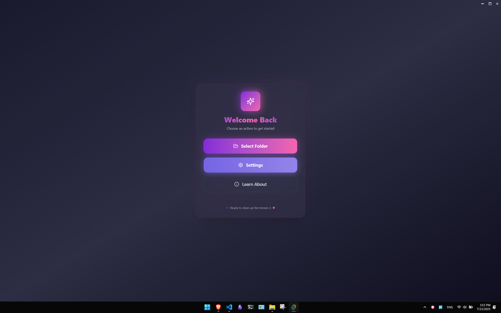
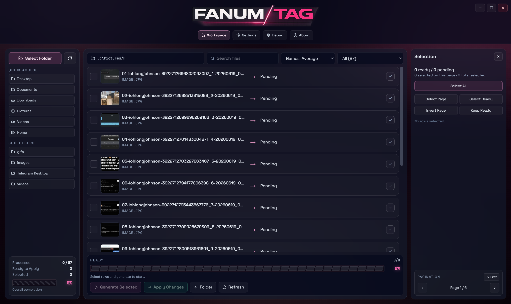
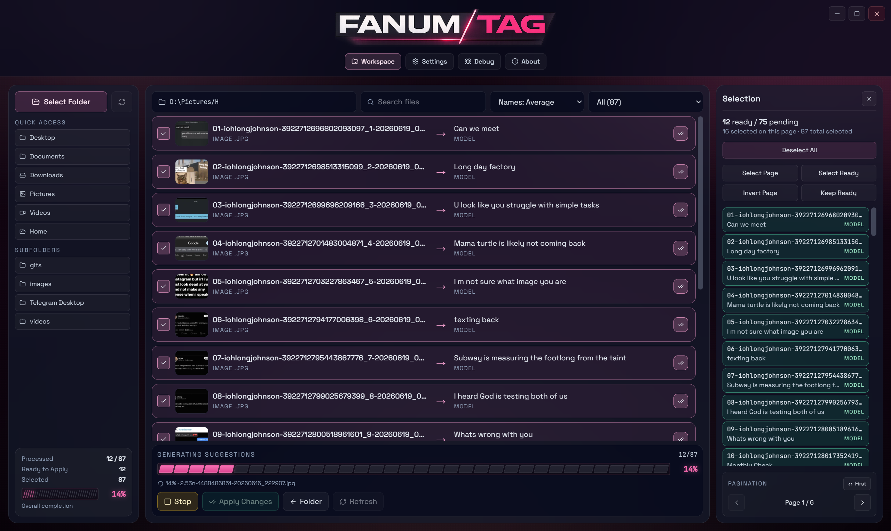
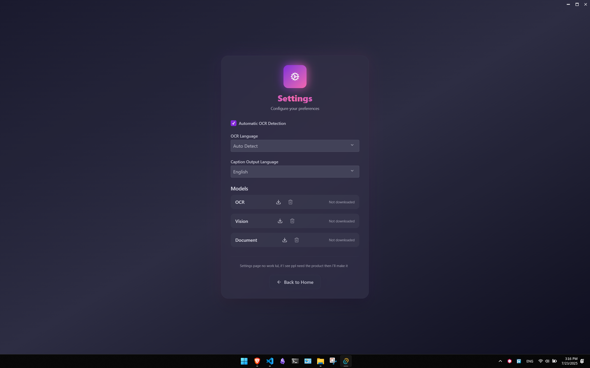

<h1 style="font-family: Arial, sans-serif; font-size: 36px; color: #77B3FF; display: flex; align-items: center; gap: 12px; border-bottom: 3px solid #77B3FF; padding-bottom: 8px;">
  
  FanumTag - Local-First AI File Renamer
</h1>

FanumTag is a local-first desktop rename workspace built with **Tauri (Rust) + SolidJS (TypeScript)**.
It scans a folder into a visual queue, uses local AI to suggest descriptive filenames, and applies safe bulk renames without uploading your files.

---

## Runtime Architecture

- Rust owns a singleton local runtime manager.
- The manager starts one bundled `llama-server.exe` process from `src-tauri/lib`.
- Vision weights are loaded from `src-tauri/weights`:
  - `Qwen2-VL-2B-Instruct-IQ2_M.gguf`
  - `mmproj-Qwen2-VL-2B-Instruct-f16.gguf`
- Frontend communicates through Tauri commands/events.

---

## Core Commands

- `runtime_get_status`
- `runtime_get_config`
- `runtime_update_config`
- `runtime_start`
- `runtime_stop`
- `runtime_cancel_batch`
- `runtime_generate_batch`
- `apply_renames`

---

## Features

- Workspace queue with folder quick access, subfolder browsing, thumbnails, search, sorting, filtering, and pagination
- Batch suggestions for images, videos, and text files, with deterministic fallback handling
- Live generation progress with per-file status, ready/pending counts, and a Stop control
- Selection tools for selecting all, selecting a page, selecting ready items, inverting a page, and keeping ready items
- Safe native renames with collision handling and Windows-name validation
- Runtime settings for host, port, threads, GPU layers, context size, request timeout, and auto-start
- Runtime health checks for bundled inference, Whisper, and FFmpeg dependencies

---

## Screenshots

### Empty workspace

Start by selecting a folder. The workspace provides quick access to common folders and keeps the selection and pagination panels ready for the queue.



### Loaded queue

Review thumbnails and pending files before generating suggestions. The queue supports search, sorting, file-type filtering, subfolders, and page navigation.



### Generating suggestions

Generation progress is shown in the workspace footer and in the per-file status column. You can stop an active batch at any time.



### Runtime settings

Configure the local runtime and check the health of its bundled dependencies from the Settings view.



---

## Development

```bash
pnpm install
pnpm tauri dev
```

## Checks

```bash
pnpm build
pnpm serve
```

## Notes

- Keep runtime and model paths local for privacy.
- No cloud dependency is required for default workflow.
