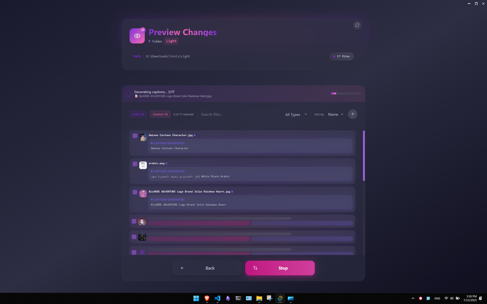
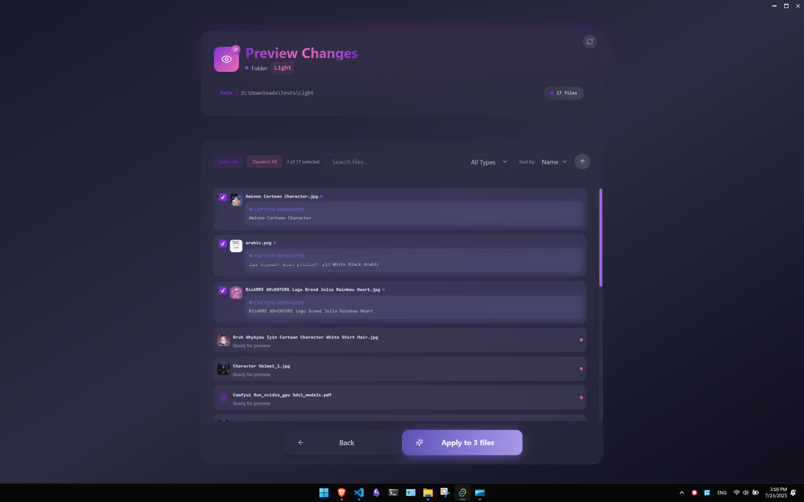

<h1 style="font-family: Arial, sans-serif; font-size: 36px; color: #77B3FF; display: flex; align-items: center; gap: 12px; border-bottom: 3px solid #77B3FF; padding-bottom: 8px;">
  
  FanumTag - Local-First AI File Renamer
</h1>

FanumTag is a local-first desktop rename workspace built with **Tauri (Rust) + SolidJS (TypeScript)**.
It runs local inference, generates structured rename suggestions, and applies safe bulk renames.

---

## Runtime Architecture

- Rust owns a singleton local runtime manager.
- The manager starts one bundled `llama-server.exe` process from `src-tauri/lib`.
- Vision weights are loaded from `src-tauri/weights`:
  - `Qwen2-VL-2B-Instruct-IQ2_M.gguf`
  - `mmproj-Qwen2-VL-2B-Instruct-f16.gguf`
- Frontend communicates through Tauri commands/events.

---

## Core Commands

- `runtime_get_status`
- `runtime_get_config`
- `runtime_update_config`
- `runtime_start`
- `runtime_stop`
- `runtime_cancel_batch`
- `runtime_generate_batch`
- `apply_renames`

---

## Features

- Folder queue preview with search/filter/pagination
- Batch suggestion generation (image/video/txt + deterministic fallback)
- Cancel support during active generation
- Safe native renames with collision handling and Windows-name validation

---

## Screenshots






---

## Development

```bash
pnpm install
pnpm tauri dev
```

## Checks

```bash
pnpm build
pnpm serve
```

## Notes

- Keep runtime and model paths local for privacy.
- No cloud dependency is required for default workflow.
